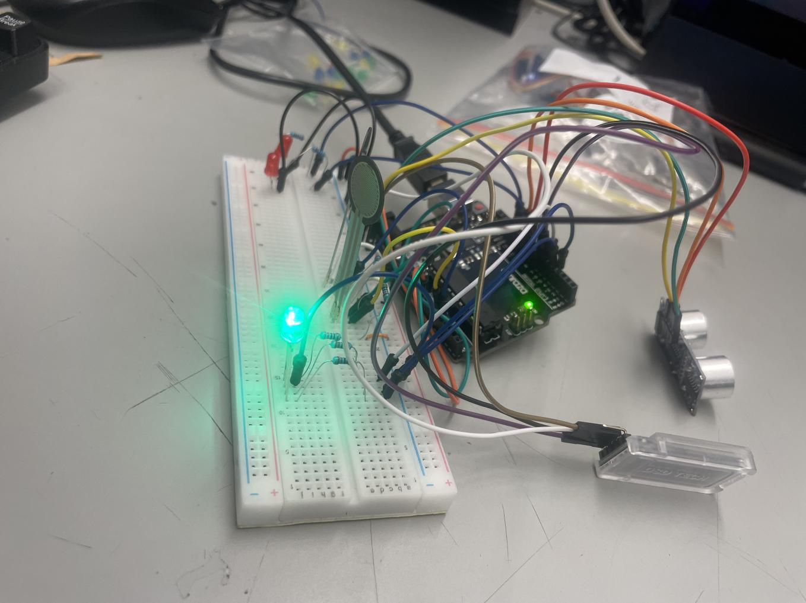
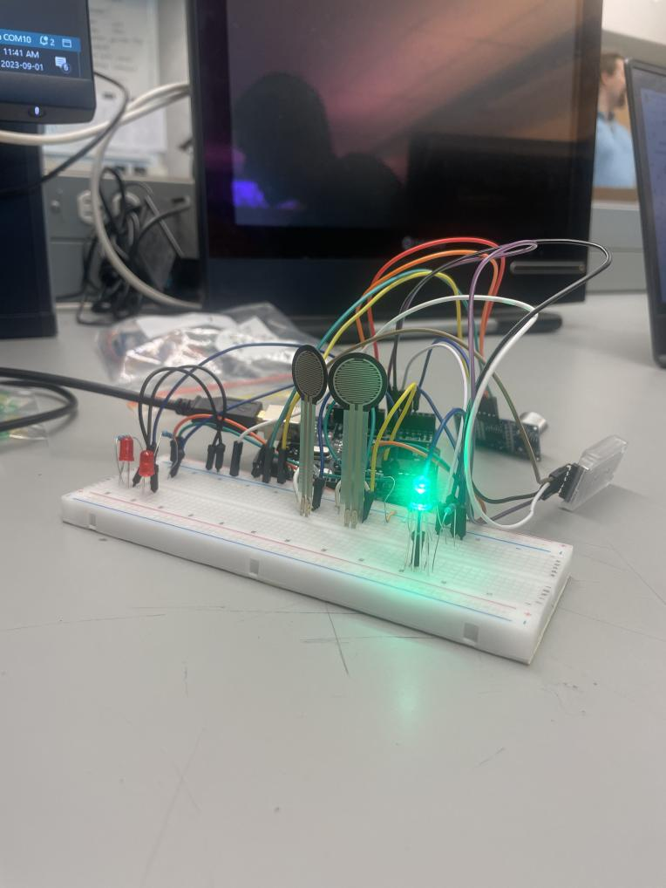

# Nautical Defence Systems
[Nautical Defence Systems](https://docs.google.com/presentation/d/1214E2kIsvExOhXtX3PYNos0zVhJ6_MI8K4hYKwoiTwA/edit#slide=id.p) detects and alerts boat users of collisions.

## The Device

With ultrasonic and force sensors, NDS detects collisions and sends an alert to your phone.

## About

- Created by Leo, Shubham, and Jay in the Summer 2023 HighTechU EngAcademy
- Winners of the Best Business Award

